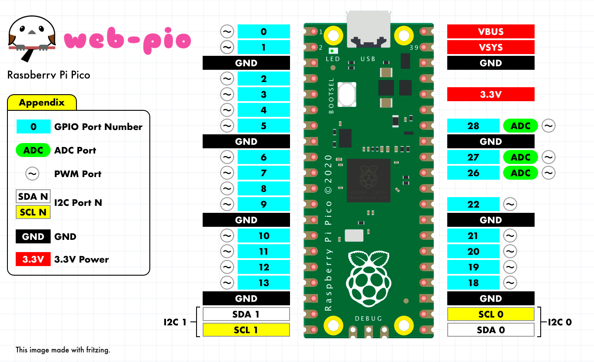

# web-pio


## Overview

web-pio (physical io for web) is a library for controlling GPIO and I2C on connected external microcontrollers using JavaScript from a browser and node.js.

It is being developed based on [CHIRIMEN Open Hardware](https://github.com/chirimen-oh/chirimen).

## Key Goals

- Support multiple microcontrollers and allows them to be connected simultaneously.
- In both browser and node.js, just import pio.mjs to get started.
- Native support for ES6 modules. No need for any bundlers.
- Supports plug and play for microcontrollers.

## Status

The library is under development and documentation has not yet begun.

### Web GPIO

Currently, only partial functionality based on the [Web GPIO API](https://browserobo.github.io/WebGPIO/) are supported.

The differences from the Web GPIO API draft specification are as follows:

|feature|Web GPIO API|web-pio|
|:---|:---|:---|
|get GPIOAccess object|navigator.requestGPIOAccess()|device.GPIOAccess|
|get GPIO Port|gpioAccess.ports.get(portNumber)|←same|
|export|port.export()|←same, but with some extensions such as "pwm"|
|write|port.write()|←same|
|read|port.read()|←same|
|onchange|port.onchange = function|←same|
|PWM|none|port.setPWM()|
|ADC|none|port.analogRead()|

### Web I2C

We also support I2C functionality based on the [Web I2C API](https://browserobo.github.io/WebI2C/).

The differences from the Web I2C API draft specification are as follows:
|feature|Web GPIO API|web-pio|
|:---|:---|:---|
|get I2CAccess object|navigator.requestI2CAccess()|device.I2CAccess|
|get I2C Port|i2cAccess.ports.get(portNumber)|←same|
|detect addresses on port|none|port.detect()|
|open slaveDevice|port.open(address)|←same|
|write 1 byte with register|slaveDevice.write8()|←same|
|write 1 word with register|slaveDevice.write16()|←same|
|write 1 byte without register|none|slaveDevice.writeByte() ※1|
|write multipule byte without register|none|slaveDevice.writeBytes() ※1|
|read 1 byte with register|slaveDevice.read8()|←same|
|read 1 word with register|slaveDevice.read16()|←same|
|read 1 Byte without register|none|slaveDevice.readByte() ※1|
|read multipule Bytes without register|none|slaveDevice.readBytes() ※1|

> ※1 These extensions are not in the specification, but have been implemented in the CHIRIMEN Open Hardware PJ.

## Support Devices

In web-pio, to prevent conflicts between GPIO and I2C, pins used for I2C are excluded from the list of ports that can be exported by the Web GPIO API.    

Some port numbers used by the Web I2C API may differ from the numbers listed in the datasheet to conform to Arduino definitions.    

See the diagram below for details.    

### [Seeed Studio XIAO RP2040](https://wiki.seeedstudio.com/XIAO-RP2040/)


### [Raspberry Pi Pico](https://www.raspberrypi.com/products/raspberry-pi-pico/)



### [Raspberry Pi Pico 2](https://www.raspberrypi.com/products/raspberry-pi-pico-2/)


## Usage

### Install dependencies and start example server

```
cd physical-io
npm i
node ./app.mjs
```

### Try examples for Browser

Please access the following URL in your browser.

```
http://localhost:3100/examples/browser/
```
### Try examples for Node.js

If you want to try out blink, use the following.

```
node ./examples/js/gpio/blink.mjs
```

## License

[MIT](LICENSE)


